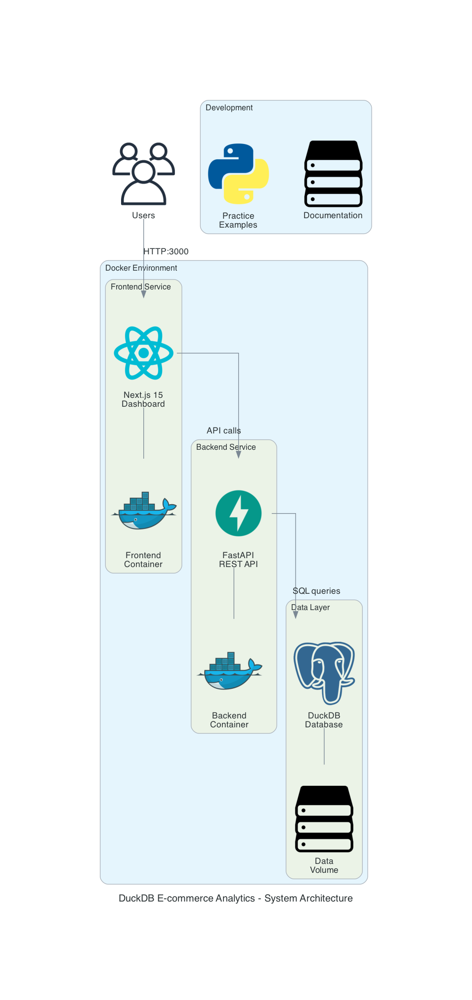
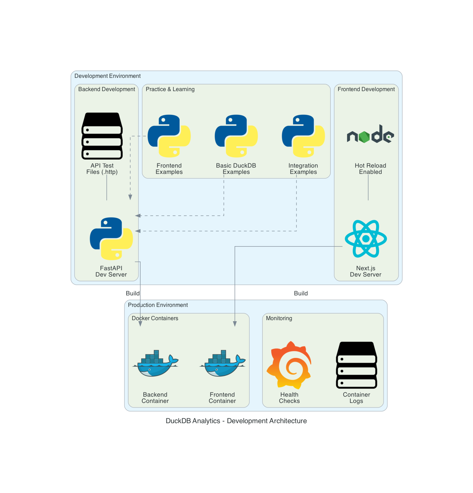
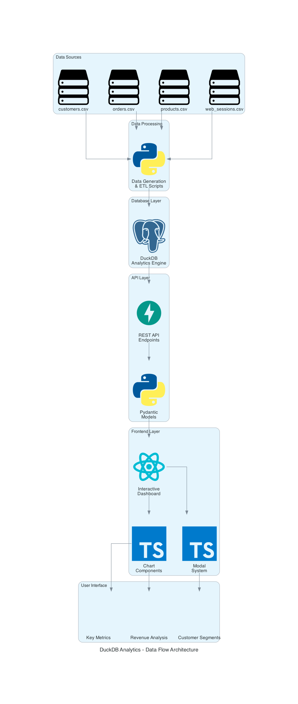
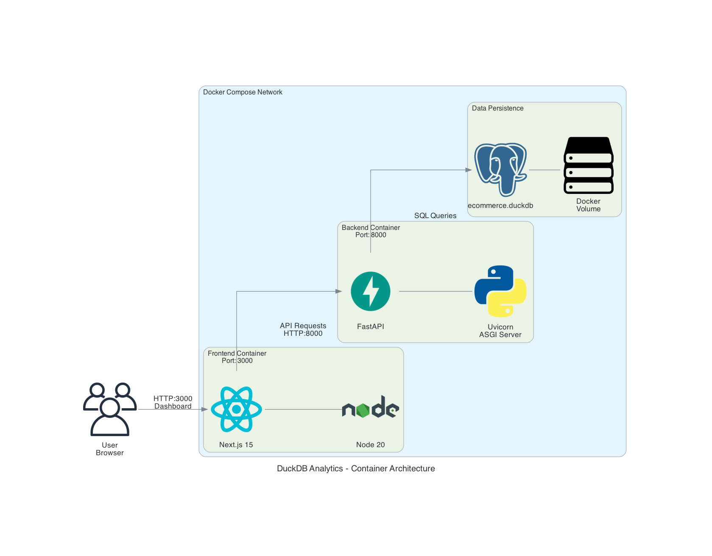
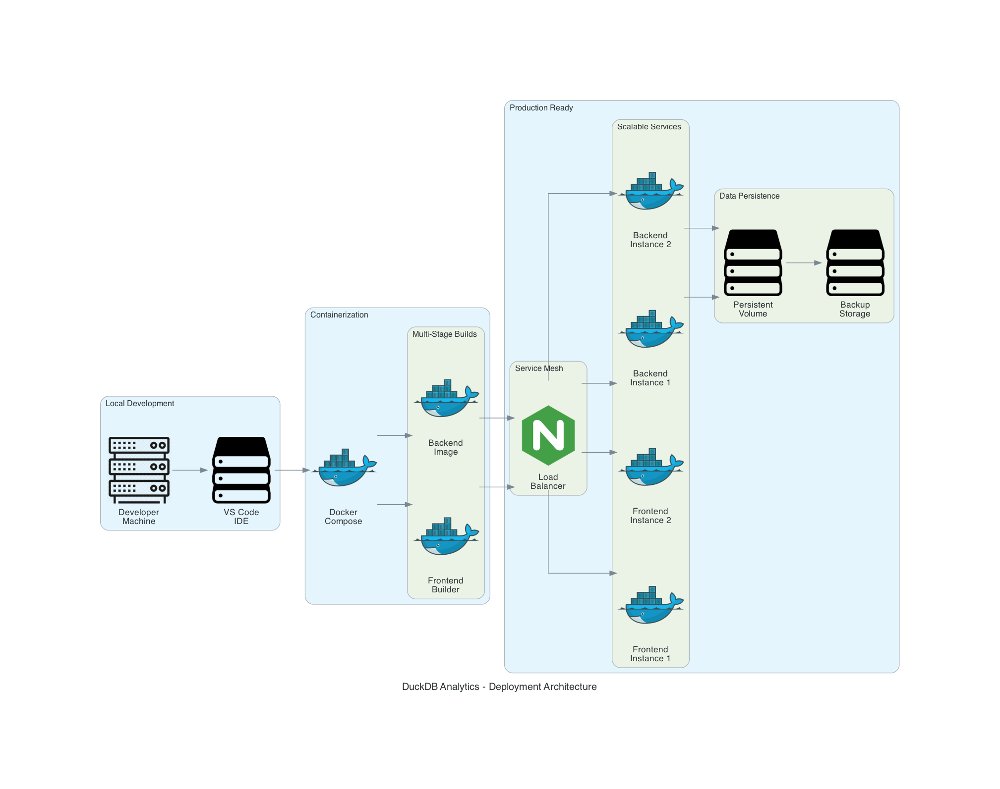
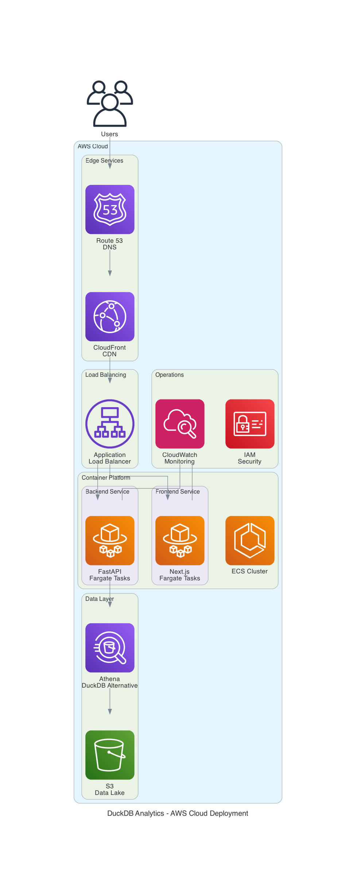
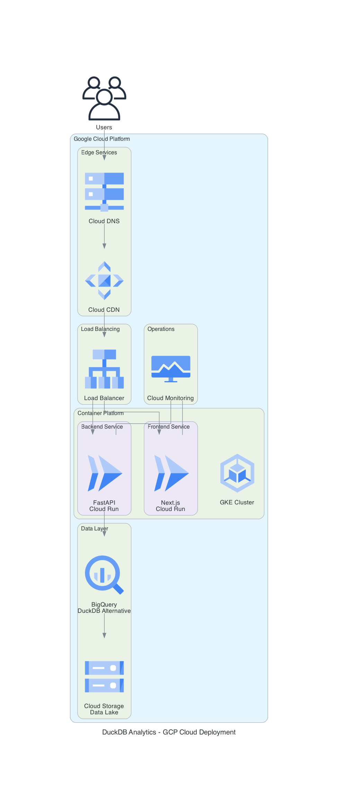
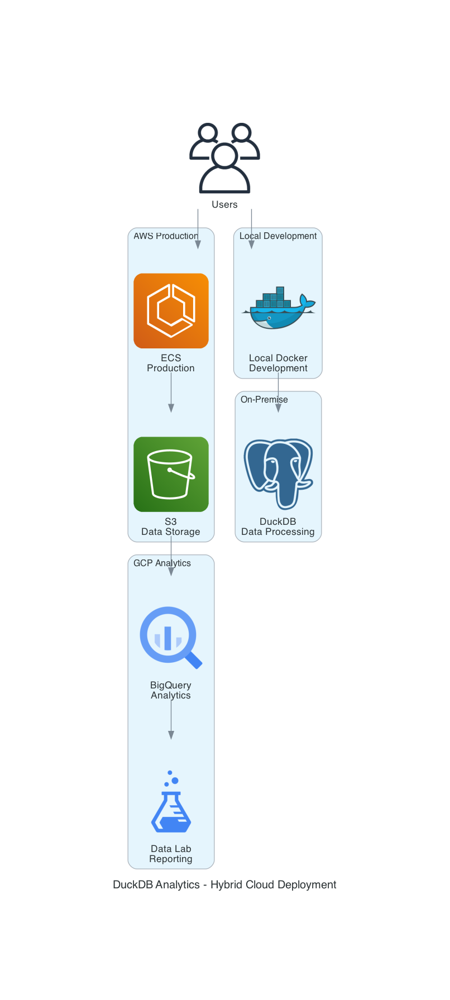

# 🏗️ Architecture Overview

This document provides a comprehensive overview of the E-commerce Analytics Platform architecture, organized by functional areas with corresponding visual diagrams.

## 📋 Table of Contents

1. [System Architecture](#-system-architecture)
2. [Development Environment](#-development-environment)
3. [Data Flow & Processing](#-data-flow--processing)
4. [Container Strategy](#-container-strategy)
5. [Deployment Architectures](#-deployment-architectures)
6. [Quick Navigation](#-quick-navigation)

---

## 🏛️ System Architecture

### Overview Diagram


**What this shows:**
- High-level system components and their relationships
- User interaction points
- Technology stack overview (Next.js Frontend, FastAPI Backend, DuckDB Database)
- Development environment integration

**Key Components:**
- **Frontend**: React/Next.js 15 dashboard with real-time analytics
- **Backend**: FastAPI service with automatic API documentation
- **Database**: DuckDB for high-performance analytics
- **Infrastructure**: Docker-based containerization

---

## 💻 Development Environment

### Development Setup Diagram


**What this shows:**
- Local development workflow
- Hot reload capabilities
- Testing and debugging setup
- Development tools integration

**Development Features:**
- **Hot Reload**: Instant code changes reflection
- **API Testing**: Built-in FastAPI docs and testing endpoints
- **Database Management**: DuckDB CLI and web interface
- **Code Quality**: ESLint, Prettier, and Python formatting tools

**Getting Started:**
```bash
# Setup development environment
make setup

# Start development services
make dev

# Run tests
make test
```

---

## 🔄 Data Flow & Processing

### Data Flow Diagram


**What this shows:**
- End-to-end data journey from CSV files to user interface
- ETL processes and data transformations
- API endpoint mappings
- Real-time data flow patterns

**Data Journey:**
1. **Source Data**: CSV files (customers, orders, products, sessions)
2. **ETL Processing**: Python scripts for data cleaning and transformation
3. **Storage**: DuckDB analytical database
4. **API Layer**: FastAPI endpoints for data access
5. **Visualization**: React components with interactive charts

**Key Endpoints:**
- `/api/analytics/revenue`: Revenue analytics and trends
- `/api/analytics/customers`: Customer behavior analysis
- `/api/analytics/products`: Product performance metrics
- `/api/reports`: Automated reporting functionality

---

## 🐳 Container Strategy

### Container Architecture Diagram


**What this shows:**
- Docker container organization
- Service communication patterns
- Network configuration
- Volume mounts and data persistence

**Container Services:**
- **Backend Container**: FastAPI application with Python dependencies
- **Frontend Container**: Next.js application with Node.js runtime
- **Database**: DuckDB file-based storage with volume persistence
- **Network**: Internal Docker network for service communication

**Container Features:**
- Health checks for service monitoring
- Environment-based configuration
- Development and production profiles
- Automatic restart policies

---

## 🚀 Deployment Architectures

### Local/Development Deployment


**What this shows:**
- Local deployment strategy
- CI/CD integration
- Container orchestration
- Monitoring and logging setup

### Cloud Deployment Options

#### AWS Cloud Deployment


**What this shows:**
- **CDN**: CloudFront for global content delivery
- **Load Balancing**: Application Load Balancer with SSL termination
- **Container Platform**: ECS with Fargate for serverless containers
- **Data Services**: S3 data lake with Athena for large-scale analytics
- **Monitoring**: CloudWatch for logging and metrics
- **Security**: IAM roles and security groups

**Key AWS Services:**
- Route 53 (DNS) → CloudFront (CDN) → ALB → ECS Fargate
- S3 (Data Lake) → Athena (Analytics) → QuickSight (BI)

📖 **[Detailed AWS Deployment Guide →](architecture/aws-deployment.md)**

#### GCP Cloud Deployment


**What this shows:**
- **CDN**: Cloud CDN for global performance
- **Load Balancing**: Cloud Load Balancer for traffic distribution
- **Container Platform**: Cloud Run for serverless containers
- **Data Services**: BigQuery for large-scale analytics
- **Monitoring**: Cloud Monitoring for observability
- **Security**: IAM and VPC for secure networking

**Key GCP Services:**
- Cloud DNS → Cloud CDN → Load Balancer → Cloud Run
- BigQuery (Analytics) → Data Studio (BI)

📖 **[Detailed GCP Deployment Guide →](architecture/gcp-deployment.md)**

#### Hybrid Multi-Cloud Deployment


**What this shows:**
- **Development**: Local Docker environment
- **Production**: AWS ECS for application hosting
- **Analytics**: GCP BigQuery for advanced analytics
- **Data Flow**: Cross-cloud data integration and synchronization

**Hybrid Benefits:**
- Best-of-breed services from multiple cloud providers
- Risk mitigation through multi-cloud strategy
- Optimized costs by choosing the right service for each need

---

## 🗺️ Quick Navigation

### By Use Case

| Use Case | Primary Diagram | Documentation |
|----------|-----------------|---------------|
| **Understanding the System** | [System Architecture](#-system-architecture) | [README.md](../README.md) |
| **Setting Up Development** | [Development Environment](#-development-environment) | [Development Guide](../README.md#development) |
| **Data Integration** | [Data Flow](#-data-flow--processing) | [API Documentation](../docs/API_README.md) |
| **Containerization** | [Container Strategy](#-container-strategy) | [Docker Documentation](../docker-compose.yml) |
| **AWS Deployment** | [AWS Architecture](#aws-cloud-deployment) | [AWS Deployment Guide](architecture/aws-deployment.md) |
| **GCP Deployment** | [GCP Architecture](#gcp-cloud-deployment) | [GCP Deployment Guide](architecture/gcp-deployment.md) |

### By Role

| Role | Recommended Diagrams | Key Documentation |
|------|---------------------|-------------------|
| **Developer** | Development + Container + Data Flow | [API Docs](../docs/API_README.md) |
| **DevOps Engineer** | All Deployment Diagrams | [AWS](architecture/aws-deployment.md) + [GCP](architecture/gcp-deployment.md) |
| **Data Analyst** | System + Data Flow | [Analytics Features](../docs/ADVANCED_FEATURES.md) |
| **Product Manager** | System + Deployment | [Project Summary](../PROJECT-SUMMARY.md) |
| **Architect** | All Diagrams | This Document |

---

## 🔧 Technical Specifications

### Technology Stack
- **Frontend**: Next.js 15, React 19, TypeScript, Tailwind CSS
- **Backend**: FastAPI, Python 3.11+, Uvicorn
- **Database**: DuckDB (analytical), SQLite (fallback)
- **Infrastructure**: Docker, Docker Compose
- **Cloud**: AWS ECS, GCP Cloud Run, Artifact Registry
- **CI/CD**: GitHub Actions with multi-cloud deployment

### Performance Characteristics
- **Database**: DuckDB provides 10-100x faster analytics than traditional OLTP databases
- **API**: FastAPI delivers high-performance async endpoints
- **Frontend**: Next.js 15 with React 19 for optimal user experience
- **Containerization**: Lightweight containers with optimized build processes

### Scalability Considerations
- **Horizontal Scaling**: Container-based architecture supports easy scaling
- **Data Growth**: DuckDB handles datasets up to several GB efficiently
- **Cloud Native**: Both AWS and GCP deployments support auto-scaling
- **Caching**: Multi-level caching strategy for optimal performance

---

## 📚 Additional Resources

- **[Project Summary](../PROJECT-SUMMARY.md)**: High-level project overview
- **[API Documentation](../docs/API_README.md)**: Complete API reference
- **[Advanced Features](../docs/ADVANCED_FEATURES.md)**: Advanced analytics capabilities
- **[Development Guide](../README.md)**: Getting started with development
- **[Architecture Generation](architecture/README.md)**: How to regenerate diagrams

---

*This documentation is automatically updated when architecture diagrams are regenerated. Last updated: $(date)*