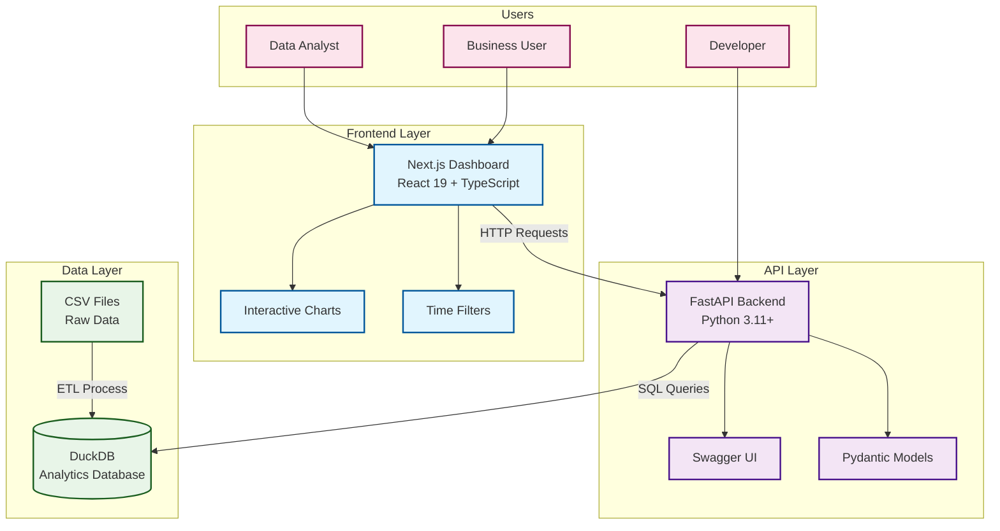

# 🆚 Mermaid vs Python Diagrams: Architecture Comparison

This document provides a direct comparison between Mermaid and Python Diagrams for architecture documentation.

## 📊 **Live Comparison**

### **System Architecture: Mermaid Version**



### **Python Diagrams Version**


---

## 🔍 **Detailed Comparison**

| Aspect | Mermaid ✅ | Python Diagrams ❌ |
|--------|------------|-------------------|
| **File Size** | ~2KB text file | ~500KB PNG image |
| **Version Control** | Clear text diffs | Binary blob changes |
| **Editability** | Any text editor | Requires Python setup |
| **GitHub Rendering** | Native markdown support | External image hosting |
| **Collaboration** | Easy review & suggestions | Hard to review changes |
| **Search & SEO** | Text content is searchable | Image content not indexed |
| **Accessibility** | Screen reader friendly | Alt text dependent |
| **Responsive** | Adapts to container width | Fixed image dimensions |
| **Themes** | CSS-based styling | Limited styling options |
| **Maintenance** | No build process needed | Requires regeneration |

---

## 🎯 **Use Case Analysis**

### **✅ When Mermaid is Better**

1. **Team Collaboration**
   - Easy to review in pull requests
   - Any developer can make updates
   - Clear change history in git

2. **Documentation Integration**
   - Renders directly in README files
   - Works in GitHub Issues and Wikis
   - No external dependencies

3. **Rapid Iteration**
   - Instant preview in VS Code
   - No build step required
   - Quick syntax for common patterns

4. **Version Control**
   - Meaningful diffs show actual changes
   - Merge conflicts are resolvable
   - Branch comparisons work properly

### **❌ When Python Diagrams Might Be Better**

1. **Complex Cloud Architecture**
   - Rich icon library (AWS/GCP/Azure)
   - Professional cloud-specific styling
   - Detailed infrastructure representation

2. **Presentation Materials**
   - High-resolution export options
   - Consistent professional styling
   - Suitable for executive presentations

3. **Automated Generation**
   - Can be generated from infrastructure code
   - Integration with CI/CD pipelines
   - Programmatic diagram creation

---

## 📈 **Migration Benefits**

### **Immediate Benefits of Switching to Mermaid**

1. **Repository Cleanup**
   - Remove ~20MB of PNG files
   - Cleaner git history
   - Faster clone times

2. **Developer Experience**
   - No Python setup required
   - Live preview while editing
   - Syntax highlighting in editors

3. **Documentation Quality**
   - Always up-to-date (no regeneration needed)
   - Embedded in markdown documentation
   - Interactive elements possible

4. **Collaboration Improvement**
   - Architecture changes in pull requests
   - Easy suggestions and reviews
   - Non-developers can contribute

---

## 🚀 **Recommendation**

### **For This Project: Use Mermaid ✅**

**Reasons:**
1. **Team-focused project** - Better collaboration
2. **Frequent updates** - Easier maintenance  
3. **Developer audience** - Technical team comfortable with markup
4. **GitHub-native** - Leverages platform features
5. **Future-proof** - Growing ecosystem and support

### **Migration Strategy**

1. **Phase 1**: Create Mermaid versions (✅ Done)
2. **Phase 2**: Update documentation to reference Mermaid
3. **Phase 3**: Gather team feedback (2 weeks)
4. **Phase 4**: Deprecate Python diagrams if team prefers Mermaid

---

## 🛠️ **Getting Started with Mermaid**

### **VS Code Setup**
```bash
# Install Mermaid Preview extension
code --install-extension bierner.markdown-mermaid
```

### **Live Editing**
1. Open any `.mmd` file
2. `Ctrl+Shift+P` → "Markdown: Open Preview to Side"
3. See changes in real-time

### **GitHub Integration**
Just commit the `.mmd` files - they render automatically in:
- README files
- Issues and Pull Requests  
- GitHub Pages
- Wiki pages

---

## 📚 **Next Steps**

1. **Try editing** one of the Mermaid files in VS Code
2. **Compare** the developer experience
3. **Review** how changes look in git diffs
4. **Decide** which approach works better for your team

*The choice ultimately depends on your team's preferences and workflow priorities.*