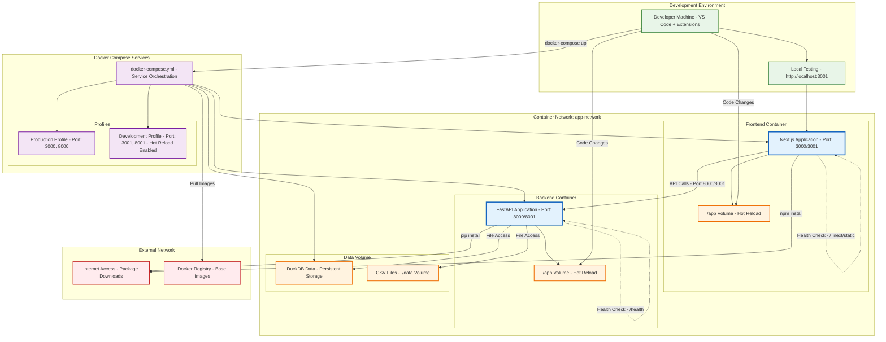

# Container Architecture

This diagram shows the containerized architecture using Docker Compose, including development and production profiles.

## Container Services

### Frontend Container
- **Technology**: Next.js with React 19
- **Ports**: 3000 (production), 3001 (development)
- **Features**: Hot reload, static optimization, TypeScript support

### Backend Container
- **Technology**: FastAPI with Python 3.11+
- **Ports**: 8000 (production), 8001 (development)
- **Features**: Auto-reload, API documentation, Pydantic validation

### Data Management
- **DuckDB**: Persistent analytics database
- **CSV Files**: Volume-mounted data sources
- **Hot Reload**: Development-time code synchronization

## Docker Compose Profiles

- **Production**: Optimized builds, standard ports (3000, 8000)
- **Development**: Hot reload enabled, alternate ports (3001, 8001)

## Network Architecture

All containers communicate through the `app-network` bridge network, enabling service discovery and secure inter-container communication.