# Data Flow Architecture

This diagram illustrates how data flows through the DuckDB Analytics Platform, from raw CSV files to the interactive dashboard.

```mermaid
flowchart LR
    subgraph "Data Sources"
        CSV1[customers.csv - 10K+ customers]
        CSV2[orders.csv - 50K+ orders]
        CSV3[products.csv - 1K+ products]
        CSV4[sessions.csv - 100K+ sessions]
    end

    subgraph "ETL Processing"
        ETL[Data Generation Script - 01_data_generation.py]
        Clean[Data Cleaning - Validation, Normalization, Relationships]
    end

    subgraph "Database Layer"
        DB[(DuckDB Database - ecommerce.duckdb)]
        Views[SQL Views - Revenue Analytics, Customer Metrics, Product Performance]
    end

    subgraph "API Endpoints"
        EP1["/api/analytics/revenue - Revenue Trends"]
        EP2["/api/analytics/customers - Customer Behavior"]
        EP3["/api/analytics/products - Product Performance"]
        EP4["/api/reports - Custom Reports"]
    end

    subgraph "Frontend Components"
        Dashboard[Analytics Dashboard]
        Charts[Interactive Charts - Line Charts, Bar Charts, Pie Charts]
        Filters[Time Range Filters - Last 30 days, Custom Range, YoY Comparison]
    end

    subgraph "User Interface"
        Browser["Web Browser - http://localhost:3000"]
        Mobile["Mobile Responsive - Tailwind CSS"]
    end

    %% Data Flow
    CSV1 --> ETL
    CSV2 --> ETL
    CSV3 --> ETL
    CSV4 --> ETL

    ETL --> Clean
    Clean --> DB
    DB --> Views

    Views --> EP1
    Views --> EP2
    Views --> EP3
    Views --> EP4

    EP1 --> Dashboard
    EP2 --> Dashboard
    EP3 --> Dashboard
    EP4 --> Dashboard

    Dashboard --> Charts
    Dashboard --> Filters

    Charts --> Browser
    Filters --> Browser
    Browser --> Mobile

    %% Real-time Updates
    DB -.->|WebSocket Updates| Dashboard

    %% Styling
    classDef source fill:#e3f2fd,stroke:#1565c0,stroke-width:2px
    classDef process fill:#f1f8e9,stroke:#558b2f,stroke-width:2px
    classDef storage fill:#fce4ec,stroke:#c2185b,stroke-width:2px
    classDef api fill:#f3e5f5,stroke:#7b1fa2,stroke-width:2px
    classDef ui fill:#fff8e1,stroke:#f57c00,stroke-width:2px
    classDef user fill:#ffebee,stroke:#d32f2f,stroke-width:2px

    class CSV1,CSV2,CSV3,CSV4 source
    class ETL,Clean process
    class DB,Views storage
    class EP1,EP2,EP3,EP4 api
    class Dashboard,Charts,Filters ui
    class Browser,Mobile user
```

## Data Pipeline Stages

1. **Data Sources**: Raw CSV files containing business data
2. **ETL Processing**: Python scripts for data transformation and loading
3. **Database Layer**: DuckDB provides fast analytics with SQL views
4. **API Endpoints**: RESTful services exposing business metrics
5. **Frontend Components**: Interactive dashboard with real-time updates
6. **User Interface**: Responsive web application accessible on all devices

## Key Features

- **High Performance**: DuckDB optimized for analytical workloads
- **Real-time Updates**: WebSocket connections for live data refresh
- **Mobile Responsive**: Tailwind CSS ensures compatibility across devices
- **Comprehensive Analytics**: Multiple data sources consolidated into unified views