# Deployment Architecture

This diagram shows the complete deployment architecture with both GCP (active) and AWS (disabled) paths.

```mermaid
graph TB
    subgraph "Development Environment"
        LOCAL[Local Development<br/>Docker Compose<br/>🏠 Developer Machine]
    end

    subgraph "CI/CD Pipeline"
        GH[GitHub Repository<br/>📚 Source Code]
        
        subgraph "GitHub Actions"
            TEST[Test Job<br/>🧪 Quality Checks]
            SEC[Security Scan<br/>🔒 Trivy Scanner]
            BUILD[Build Job<br/>🐳 Docker Images]
        end
    end

    subgraph "Google Cloud Platform"
        direction TB
        
        subgraph "Artifact Registry"
            AR[us-west1-docker.pkg.dev<br/>📦 Container Images]
            
            subgraph "Repositories"
                BACK_IMG[Backend Image<br/>duckdb-analytics/backend]
                FRONT_IMG[Frontend Image<br/>duckdb-analytics/frontend]
            end
        end

        subgraph "Cloud Run Services"
            CR_BACK[Backend Service<br/>🚀 Serverless Container]
            CR_FRONT[Frontend Service<br/>🎨 Static + SSR]
        end

        subgraph "Networking"
            LB[Load Balancer<br/>⚖️ Traffic Distribution]
            CDN[Cloud CDN<br/>🌐 Global Caching]
            DNS[Cloud DNS<br/>🔗 Domain Management]
        end

        subgraph "Data Services"
            BUCKET[Cloud Storage<br/>☁️ File Storage]
            BQ[BigQuery<br/>📊 Analytics Warehouse]
        end

        subgraph "Monitoring"
            MON[Cloud Monitoring<br/>📈 Metrics & Alerts]
            LOG[Cloud Logging<br/>📝 Centralized Logs]
        end
    end

    subgraph "Alternative: AWS Deployment"
        direction TB
        
        subgraph "Container Services"
            ECR[Amazon ECR<br/>📦 Container Registry]
            ECS[Amazon ECS<br/>🐳 Container Platform]
            FARGATE[AWS Fargate<br/>🚀 Serverless Containers]
        end

        subgraph "AWS Networking"
            ALB[Application Load Balancer<br/>⚖️ Layer 7 Routing]
            CF[CloudFront CDN<br/>🌐 Edge Locations]
            R53[Route 53<br/>🔗 DNS Service]
        end

        subgraph "AWS Data"
            S3[Amazon S3<br/>☁️ Object Storage]
            ATHENA[Amazon Athena<br/>📊 Serverless Analytics]
        end
    end

    %% Development Flow
    LOCAL --> GH
    GH --> TEST
    TEST --> SEC
    SEC --> BUILD
    
    %% GCP Deployment
    BUILD --> AR
    AR --> BACK_IMG
    AR --> FRONT_IMG
    
    BACK_IMG --> CR_BACK
    FRONT_IMG --> CR_FRONT
    
    CR_BACK --> LB
    CR_FRONT --> LB
    LB --> CDN
    CDN --> DNS
    
    %% Data Flow (GCP)
    CR_BACK --> BUCKET
    BUCKET --> BQ
    
    %% Monitoring (GCP)
    CR_BACK --> MON
    CR_FRONT --> MON
    CR_BACK --> LOG
    CR_FRONT --> LOG
    
    %% Alternative AWS Path (Disabled)
    BUILD -.->|Disabled| ECR
    ECR -.-> ECS
    ECS -.-> FARGATE
    FARGATE -.-> ALB
    ALB -.-> CF
    CF -.-> R53
    FARGATE -.-> S3
    S3 -.-> ATHENA

    %% User Access
    DNS --> |HTTPS Traffic| USERS[👥 End Users<br/>Web Dashboard]
    R53 -.-> |HTTPS Traffic| USERS

    %% Styling
    classDef dev fill:#e8f5e8,stroke:#2e7d32,stroke-width:2px
    classDef cicd fill:#e3f2fd,stroke:#1565c0,stroke-width:2px
    classDef gcp fill:#4285f4,color:#fff,stroke:#1a73e8,stroke-width:3px
    classDef aws fill:#ff9900,color:#fff,stroke:#ff6600,stroke-width:2px
    classDef storage fill:#fff3e0,stroke:#ef6c00,stroke-width:2px
    classDef network fill:#f3e5f5,stroke:#7b1fa2,stroke-width:2px
    classDef monitor fill:#ffebee,stroke:#c62828,stroke-width:2px
    classDef user fill:#f1f8e9,stroke:#689f38,stroke-width:2px
    classDef disabled fill:#f5f5f5,stroke:#9e9e9e,stroke-width:1px,stroke-dasharray: 5 5

    class LOCAL dev
    class GH,TEST,SEC,BUILD cicd
    class AR,BACK_IMG,FRONT_IMG,CR_BACK,CR_FRONT gcp
    class ECR,ECS,FARGATE,ALB,CF,R53,S3,ATHENA disabled
    class BUCKET,BQ storage
    class LB,CDN,DNS network
    class MON,LOG monitor
    class USERS user
```

## Key Features Shown

- **Active GCP Path**: Solid lines and blue styling show the current deployment strategy
- **Disabled AWS Path**: Dashed lines and gray styling show the alternative (disabled) architecture
- **Color Coding**: Different colors for development, CI/CD, storage, networking, and monitoring
- **Clear Flow**: From development → CI/CD → container registry → cloud services → users