# Development Workflow

This diagram shows the complete development workflow, from local setup to testing and deployment preparation.

```mermaid
graph TB
    subgraph "Developer Workflow"
        DEV[Developer<br/>👩‍💻 Local Machine]
        IDE[VS Code<br/>Extensions & Linting]
        GIT[Git Repository<br/>Version Control]
    end

    subgraph "Development Commands"
        MAKE[Makefile Commands<br/>📋 Automation]
        
        subgraph "Setup Commands"
            SETUP[make setup<br/>🚀 Initial setup]
            DATA[make setup-data<br/>📊 Generate test data]
            DEPS[make install-deps<br/>📦 Install dependencies]
        end

        subgraph "Development Commands"
            RUN[make dev<br/>🔄 Start dev servers]
            TEST[make test<br/>🧪 Run test suite]
            LINT[make lint<br/>✨ Code formatting]
        end

        subgraph "CI Commands"
            CI[make ci-test<br/>🏗️ CI simulation]
            BUILD[make build<br/>🐳 Docker build]
        end
    end

    subgraph "Development Services"
        direction LR
        
        subgraph "Frontend Dev"
            FE_DEV[Next.js Dev Server<br/>Port: 3001<br/>🔥 Hot Reload]
            FE_TOOLS[Development Tools<br/>• ESLint<br/>• TypeScript<br/>• Tailwind CSS]
        end

        subgraph "Backend Dev"
            BE_DEV[FastAPI Dev Server<br/>Port: 8001<br/>🔄 Auto-reload]
            BE_TOOLS[Development Tools<br/>• Python debugger<br/>• API docs<br/>• Hot reload]
        end
    end

    subgraph "Testing & Quality"
        TESTS[Test Suite<br/>🧪 Automated Testing]
        
        subgraph "Frontend Tests"
            FE_TEST[Jest + React Testing<br/>Component Tests]
            FE_LINT[ESLint + Prettier<br/>Code Quality]
            FE_TYPE[TypeScript Check<br/>Type Safety]
        end

        subgraph "Backend Tests"
            BE_TEST[Pytest + FastAPI<br/>API Tests]
            BE_LINT[Flake8 + Black<br/>Code Formatting]
            BE_COV[Coverage Reports<br/>Test Coverage]
        end
    end

    subgraph "Data Development"
        DB_DEV[DuckDB Development<br/>🦆 Local Database]
        DATA_GEN[Test Data Generation<br/>📊 Faker Library]
        SQL_DEV[SQL Development<br/>💻 Query Testing]
    end

    %% Developer Flow
    DEV --> IDE
    IDE --> GIT
    DEV --> MAKE

    %% Command Flow
    MAKE --> SETUP
    MAKE --> DATA
    MAKE --> DEPS
    MAKE --> RUN
    MAKE --> TEST
    MAKE --> LINT
    MAKE --> CI
    MAKE --> BUILD

    %% Development Services
    RUN --> FE_DEV
    RUN --> BE_DEV
    FE_DEV --> FE_TOOLS
    BE_DEV --> BE_TOOLS

    %% Testing Flow
    TEST --> TESTS
    TESTS --> FE_TEST
    TESTS --> FE_LINT
    TESTS --> FE_TYPE
    TESTS --> BE_TEST
    TESTS --> BE_LINT
    TESTS --> BE_COV

    %% Data Flow
    DATA --> DATA_GEN
    DATA_GEN --> DB_DEV
    BE_DEV --> SQL_DEV
    SQL_DEV --> DB_DEV

    %% Feedback Loops
    FE_TOOLS -.->|Real-time Feedback| IDE
    BE_TOOLS -.->|Auto-reload| IDE
    TESTS -.->|Test Results| IDE
    LINT -.->|Format on Save| IDE

    %% Git Integration
    LINT --> GIT
    TEST --> GIT
    BUILD --> GIT

    %% Styling
    classDef dev fill:#e8f5e8,stroke:#2e7d32,stroke-width:3px
    classDef cmd fill:#e3f2fd,stroke:#1565c0,stroke-width:2px
    classDef service fill:#fff3e0,stroke:#ef6c00,stroke-width:2px
    classDef test fill:#f3e5f5,stroke:#7b1fa2,stroke-width:2px
    classDef data fill:#ffebee,stroke:#c62828,stroke-width:2px
    classDef tool fill:#f1f8e9,stroke:#689f38,stroke-width:2px

    class DEV,IDE,GIT dev
    class MAKE,SETUP,DATA,DEPS,RUN,TEST,LINT,CI,BUILD cmd
    class FE_DEV,BE_DEV service
    class TESTS,FE_TEST,FE_LINT,FE_TYPE,BE_TEST,BE_LINT,BE_COV test
    class DB_DEV,DATA_GEN,SQL_DEV data
    class FE_TOOLS,BE_TOOLS tool
```

## Development Workflow Steps

### 1. Initial Setup
- `make setup`: Complete environment initialization
- `make setup-data`: Generate sample analytics data
- `make install-deps`: Install all project dependencies

### 2. Development
- `make dev`: Start both frontend and backend in development mode
- **Frontend**: Next.js on port 3001 with hot reload
- **Backend**: FastAPI on port 8001 with auto-reload

### 3. Quality Assurance
- `make test`: Run comprehensive test suite
- `make lint`: Code formatting and style checks
- **TypeScript**: Static type checking
- **Coverage**: Test coverage reporting

### 4. CI/CD Preparation
- `make ci-test`: Simulate CI environment locally
- `make build`: Create production Docker images

## Key Features

- **Automated Setup**: Single command initialization
- **Hot Reload**: Real-time code changes in development
- **Comprehensive Testing**: Frontend and backend test suites
- **Code Quality**: Automated linting and formatting
- **Type Safety**: Full TypeScript integration
- **Database Development**: Local DuckDB with sample data