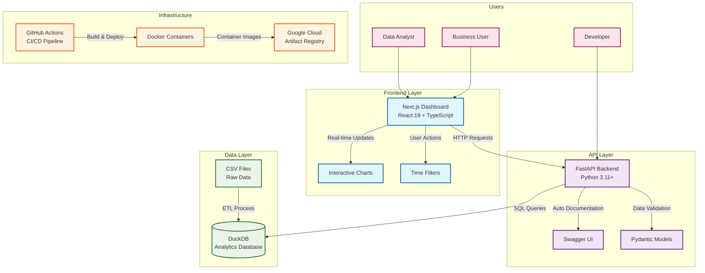

# System Architecture

This diagram shows the high-level system architecture of the DuckDB Analytics Platform, including the user types, application layers, and infrastructure components.

## Key Components

- **Users**: Different user types with specific needs and access patterns
- **Frontend**: Modern React-based dashboard with real-time capabilities
- **Backend**: FastAPI providing RESTful endpoints with automatic documentation
- **Data**: DuckDB for analytics with CSV data ingestion pipeline
- **Infrastructure**: Containerized deployment with CI/CD automation